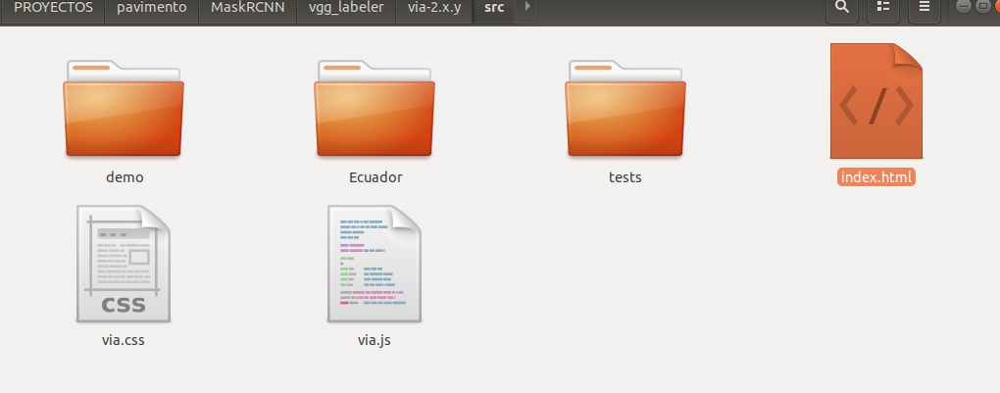
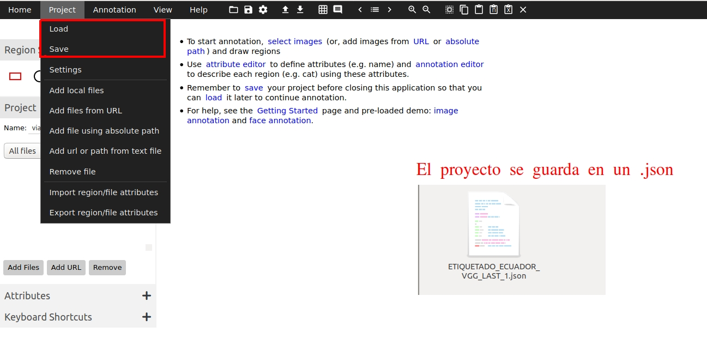
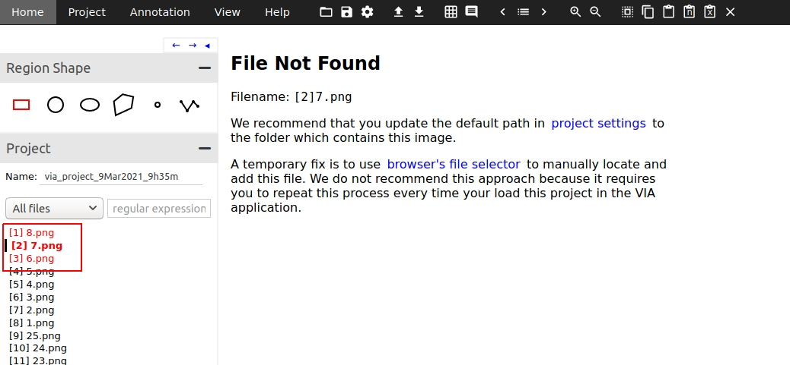
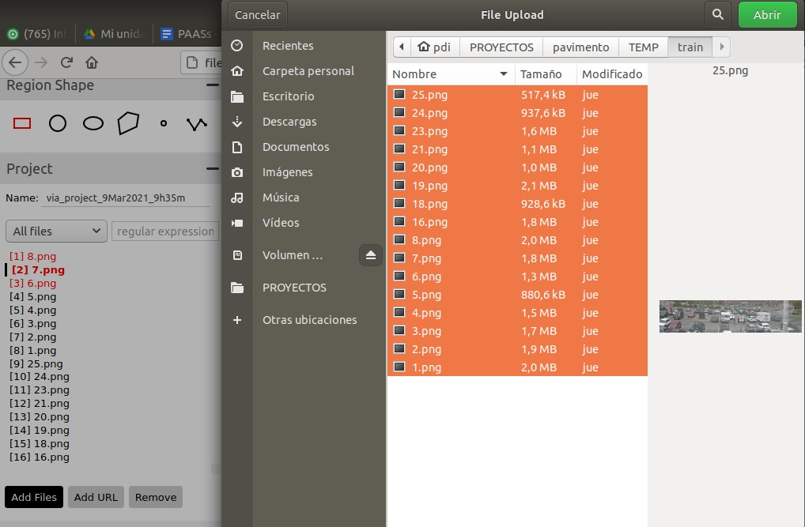
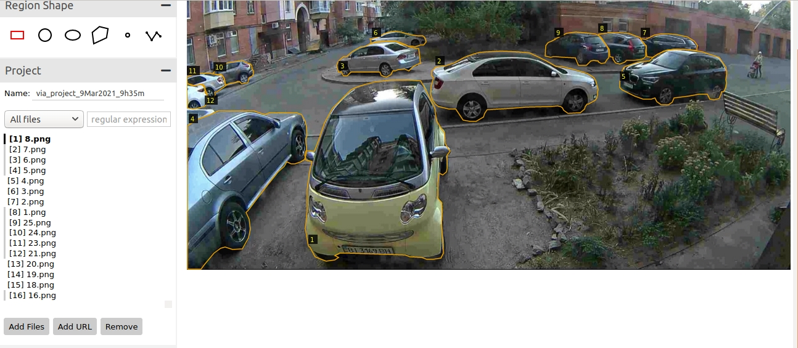

# DATASET
Here will be place **train** and **val** folders, each one with images and anotations

dataset/  
--train/  
----via_export_json_train.json  
----img1.jpg  
----img2.jpg  
----...  
--val/  
----via_export_json_val.json  
----img21.jpg  
----img22.jpg  
---....  

Where via_export_json_val.json and via_export_json_train.json are obtained from label all images  
using VGG label software. https://gitlab.com/vgg/via **via-2.x.y**
**Original url:** https://gitlab.com/vgg/via  
## Download VGG LABEL and open it.
Clone Vgg label open file **via-2.x.y/src/index.html** with firefox or chrome.  
  
## Load or save project
When click on load you have to find de **ETIQUETADO.json** project. Or when click save you save that .json file with project information.  
  
## Image not found
Sometimes when project is loaded image is not found. Apears with red letters and an alert.

So you have to load that images by you own, clicking on **Add Files** button an selecting all images you need.  
  
## Images loaded
When images are loaded successfully you can see the labels, or trace new labels.  

